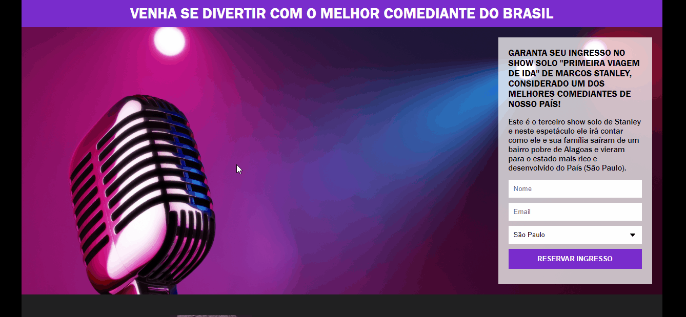

<h1 align="center"><strong>Landing Page </strong>🚀</h1>

<h2><strong>Status:</strong> Finished ✔️</h2>

### This project was developed in my programming course (Programador-Br), in order to improve my knowledge of <strong>HTML</strong> and <strong>CSS</strong>. It is a landing Page.
 

     
          
    

 

## **🚀 Technologies** 

 

 ✅ HTML

 ✅ CSS

 ✅ MAILCHIMP

 

## **🐵 What is Mailchimp?**

 

<h3>Mailchimp is a complete marketing platform designed for small businesses. In this project, I used Mailchimp to send an email to all users who registered on the landing page. This email contains information about the price, and seats for Marcos Stanley fictional show.

</h3>

 

## 💻 Click on [Marcos Stanley Show!], and use my Landing Page!😎

 

### Thanks for reading so far. if you want to contact me, feel free to send me a message or send a connection request on my [linkedIn](https://www.linkedin.com/in/mateus-silva-folego260601/) ❤!

 

<h2 align="center"> 📖 Always remember you`re <strong>NEVER</strong> alone!

